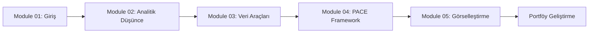

# 01-İleri Veri Analitiği

Bu klasör, **İleri Veri Analitiği** konularında derinlemesine bilgi ve uygulamaları içermektedir. Veri bilimi alanında uzmanlaşmak isteyen kişiler için gerekli olan ileri düzey teknikleri, araçları ve metodolojileri kapsamaktadır.

---

## 📊 Amaç

Bu bölümün temel amacı, veri analitiği alanında ileri düzey yetkinlikler kazandırmaktır:

- **İleri Analiz Teknikleri:** Kompleks veri setleri üzerinde derinlemesine analiz yapabilme becerileri
- **İstatistiksel Modelleme:** İleri düzey istatistiksel yöntemler ve model geliştirme
- **Veri Görselleştirme:** Etkili ve profesyonel veri görselleştirme teknikleri
- **İş Zekası:** Analitik sonuçları iş kararlarına dönüştürme yeteneği

---

## 📚 İçerik Yapısı

### Ana Bölüm
- **foundations-of-data-science/** - Google Advanced Data Analytics temelli kapsamlı içerikler
  - module-01.md → Veri Bilimi ve Veri Analitiği Dünyasına Giriş
  - module-02.md → Veri Analisti Olarak Düşünmek  
  - module-03.md → Elektronik Tablolarla Çalışma ve Veri Kariyerlerinin Geleceği
  - module-04.md → SQL Temelleri ve PACE Framework
  - module-05.md → Görselleştirme ve Portföy Geliştirme

### Destek Materyalleri
- **assets/images/** - Görsel içerikler ve diyagramlar

> **Not:** Bu modüller Google Advanced Data Analytics Certificate programından uyarlanmış ve Türkçe olarak düzenlenmiştir.

---

## 🎯 Öğrenme Hedefleri

Bu bölümü tamamladığınızda şunları başarabileceksiniz:

- **Veri Analitiği Süreci:** PACE (Plan, Analyze, Construct, Execute) framework'ünü uygulama
- **İş Dünyası Perspektifi:** Veri analizinin iş kararlarına etkisini anlama
- **Teknik Beceriler:** Temel analiz araçlarını kullanma
- **İletişim:** Analiz sonuçlarını etkili bir şekilde sunma
- **Kariyer Geliştirme:** Veri alanında profesyonel gelişim stratejileri

---

## 🎯 Hedef Kitle

Bu içerikler şu kişiler için hazırlanmıştır:
- Veri analisti olmak isteyen profesyoneller
- İş analistleri ve iş zekası uzmanları
- Veri bilimi alanında kariyer yapmak isteyenler
- Analitik düşünme becerilerini geliştirmek isteyenler

---

## 🚀 Nasıl Başlanır?

1. **Sıralı İlerleme:** foundations-of-data-science klasöründeki modülleri sırası ile takip edin
2. **Uygulamalı Öğrenme:** Her konuda verilen örnekleri uygulayın
3. **Proje Geliştirme:** Öğrendiklerinizi gerçek projelerle pekiştirin
4. **Topluluk Etkileşimi:** Sorularınızı paylaşın ve tartışmalara katılın

---

## 📈 Önerilen Öğrenme Yolu

Her modül tamamlandıktan sonra, edinilen bilgileri gerçek veri setleri üzerinde uygulayarak deneyim kazanmanız önerilir.
