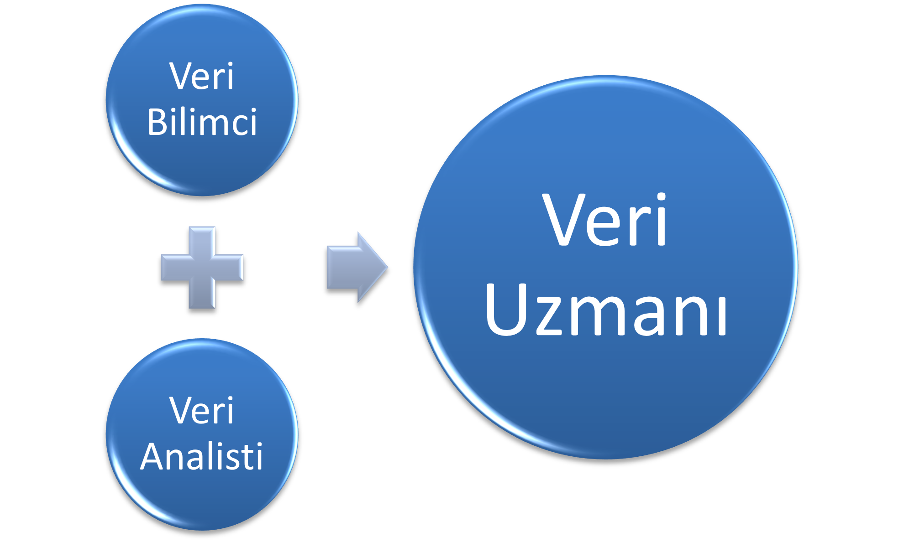

# 📊 Modül 1: Veri Bilimi ve Veri Analitiği Dünyasına Giriş

Bu modülde veri bilimi ve veri analitiği alanlarının temellerini, farklılıklarını ve ortak noktalarını öğreneceksiniz. Veri kariyer alanında hangi fırsatların bulunduğunu ve bu alanda nasıl uzmanlaşabileceğinizi keşfedeceksiniz.

---

## 🔍 Veri Bilimi vs. Veri Analitiği

| VERİ BİLİMİ                                                                                    | VERİ ANALİTİĞİ                                                                                |
| ---------------------------------------------------------------------------------------------- | --------------------------------------------------------------------------------------------- |
| Veriler üzerine düşünmeyi sağlayarak hangi soruların sorulması gerektiğine odaklanır           | Sorulan soruların cevaplarını keşfetmeye odaklanır.                                           |
| İleri düzey analizler kullanır ve geleceğe yönelik tahminlerde bulunur. Belirsizlikle yüzleşir | Mevcut sorgulara dayanarak hemen uygulanabilecek, eyleme dönüştürülebilir içgörüler belirler. |
| “Ne olacak?” ve “X’i nasıl gerçekleştirebiliriz?” gibi geleceğe dönük sorulara yanıt arar.     | “Ne oldu?” ve “Neden oldu?” gibi geçmişe dönük sorulara cevap bulmaya çalışır.                |

## BİRBİRLERİ ARASINDAKİ İLİŞKİ

Veri Bilimi ve Veri Analitiği şirketlere fayda sağlayacak içgörüler üretmeyi ortak amaç edinir ve genellikle aynı araçları ve programlama dillerini kullanırlar. Projeler karmaşıklaştıkça veri analistleri ve veri bilimciler iş birliği içinde hareket eder. Sorumlulukları ise şirketin kaynaklarına, bütçesine ve sektöre göre değişebilir. Bu benzerlikler nedeniyle iki unvan birbirinin yerine kullanılabilir ve bu durum iş ilanlarına da yansımıştır.

## 👥 VERİ UZMANLARI

"Veri uzmanı" hem veri bilimcisini hem de analisti kapsayan genel bir terim olarak kullanılmaktadır. "Veri analitiği uzmanı" daha çok analiz odaklı işlerde çalışanları belirtmek için kullanılıyor. "Veri kariyeri alanı" ise tüm bu meslekleri kapsayan şemsiye bir ifade olarak karşımıza çıkmaktadır. Bu terimlerin amacı, veriyle ilgili iş unvanlarını mümkün olduğunca kapsayıcı ve düzenli bir şekilde sınıflandırmayı sağlamaktır.
Veri uzmanları, farklı sektörlerde çeşitli sorumluluklar üstlenebilir. Aynı unvana sahip kişiler farklı kurumlarda farklı görevler yapabilir. Bu nedenle, "veri kariyeri alanı", veri bilimi becerilerine sahip kişilere sunulan tüm kariyer ve iş fırsatlarını kapsayan genel bir terim olarak kullanılır.

## ZAMAN İÇİNDE VERİ KARİYER ALANININ EVRİMİ

Veri kariyer alanı, 1965’ten günümüze teknoloji ve ihtiyaçlarla birlikte büyük bir dönüşüm geçirdi. Başlangıçta hesaplamalar elle yapılıyordu, delgeç kartlar ve manyetik bantlar gibi fiziksel araçlar veri depolamak için kullanılıyordu. 1980'lerde kişisel bilgisayarların yaygınlaşması ve elektronik tablolar veri anaizini kolaylaştırdı. Disketler ve sabit diskler sayesinde veri depolama kapasitesi arttı. Ayrıca e-posta gibi iletişim araçlarıyla kurumlar arası bilgi paylaşımı hızlandı. 2000’li yıllarda internetin yaygınlaşması ve akıllı cihazların ortaya çıkmasıyla veri artık her yerde ulaşılabilir hale geldi. Bu sayede şirketler büyük veri kavramıyla tanıştı ve Bulut bilişim, veri depolamada yeni bir dönem başlattı. Günümüzde ise yapay zeka, artırılmış gerçeklik, IoT ve uzaktan çalışma araçlarıyla veri bilimi daha güçlü ve erişilebilir hale geldi. Artık yalnızca veriyi analiz etmek değil, aynı zamanda veriden anlamlı içgörüler çıkarmak, tahminler yapmak ve otomatik sistemler kurmak mümkün hale geldi. Sanal toplantılar, görev yönetimi yazılımları ve eş zamanlı olmayan çalışma düzenleri ise veri profesyonellerinin dünya genelinde esnek bir şekilde çalışabilmesini sağladı.

## VERİ ARAÇ KUTUSU (DATA TOOLBOX)

### Programlama Dilleri: R ve Python

| Özellik             | R                                                             | Python                                                         |
| ------------------- | ------------------------------------------------------------- | -------------------------------------------------------------- |
| Topluluk            | Akademik çevrelerde yaygındır                                 | Geniş açık kaynak topluluğu ve bol çevrimiçi kaynak            |
| Kullanım Amacı      | Özellikle istatistiksel analizler ve modeller için kullanılır | Veri işleme, analiz, uygulama geliştirme ve daha fazlası       |
| Kod Yazım Kolaylığı | Kısa kodlarla karmaşık istatistiksel modeller kurulabilir     | Okunabilirlik odaklıdır, yazımı ve öğrenmesi kolay             |
| Esneklik            | İstatistik odaklı güçlü bir araçtır                           | Yüksek esnekliğe sahiptir, farklı veri görevlerine uyum sağlar |

### Kodlama Ortamı: Jupyter Notebook

Python kodlarını yazmak ve çalıştırmak için kullanılan Jupyter Notebook , kodu gerçek zamanlı olarak çalıştırmamıza ve hataları kolayca tespit etmemize yardımcı olur.

### Görselleştirme: Tableau

Analiz sonuçlarının etkili şekilde sunulmasını için kullanılan araçtır. Karmaşık veri analizlerini anlaşılır hale getirir.

### Etkili İletişim

Veriden anlam çıkarmak kadar, bu bilgiyi etkili bir şekilde aktarabilmek de önemlidir. Kişisel bakış açımız bizi diğerlerinden ayıran en değerli özelliğimizdir.
