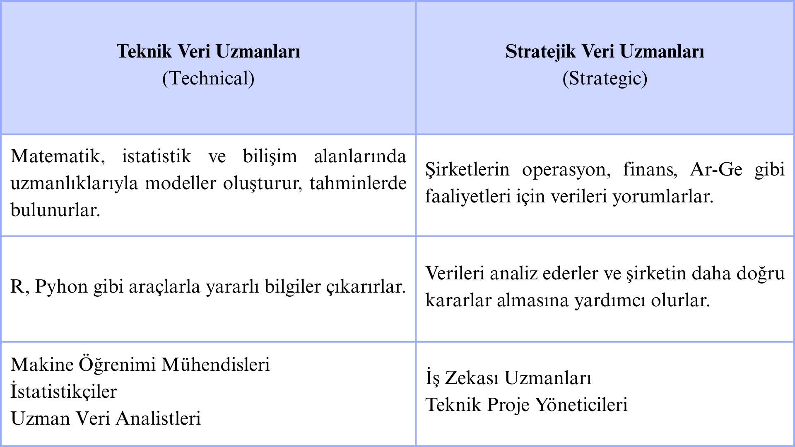

# 💼 Modül 2: Veri Analisti Olarak Düşünmek

Bu modülde veri analisti perspektifini geliştirmeyi, farklı veri rollerini anlamayı ve veri ekiplerinin nasıl çalıştığını öğreneceksiniz. Ayrıca verinin neden değerli olduğunu ve farklı sektörlerdeki uygulamalarını keşfedeceksiniz.

---

## 💎 Veri Neden Değerlidir?

Şirketler, hangi verilerin sorunlara yol açabileceği ya da fırsat sunabileceğine karar verirler. Bu verileri kullanarak geleceğe yönelik temel hedefler belirler ve şirket süreçlerini iyileştirirler.

Tüm bunları yapmak için veri ekipleri, çeşitli bilgi ve becerilere sahip kişilere ihtiyaç duyarlar. Bu nedenle veri alanında çok sayıda görev ve rol vardır ve bu roller çalışılan sektöre ve koşullara göre değişiklik göstermektedir.

Veri kariyerleri genelde iki temel alana ayrılır:

- **Teknik Roller**
- **Stratejik Roller**

## Veri Uzmanlarının Farklı Sektörlerdeki Rolü

Veri uzmanlarının birçok sektörde önemli görevleri vardır. Finansta riskleri analiz eder, piyasa trendlerini inceler ve dolandırıcılığı önlerler. Sağlıkta, büyük veri analiziyle erken teşhis ve doğru tanı süreçlerinde rol alırlar. Üretimde, kalite kontrol ve lojistikte verimlilik sağlarlar. Tarımda ise, veriyle desteklenen yenilikçi yöntemler geliştirerek üretkenliği artırırlar.

## Veri Geleceği Nasıl Şekillendiriyor?

| Sektör                           | Kullanım Alanları                                                                                                                                |
| -------------------------------- | ------------------------------------------------------------------------------------------------------------------------------------------------ |
| **Uygulama Tabanlı İşletmeler**  | - Uygulamaların düzgün çalışması   - Kullanıcı geçmişine yönelik içerik ve indirim önerisi   - Zaman ve konum bazlı bildiri gönderimi      |
| **Otomotiv**                     | - Tedarik zinciri ve üretim süreci optimizasyonu   - Güvenli ve verimli araç tasarlama   - Yeni araç özelliklerinin geliştirilmesine katkı |
| **Siber Güvenlik**               | - Güvenlik açığı tahmini   - Saldırıların önceden tespiti   - Yapay Zeka ile anlık tehdit algılama                                         |
| **Dijital Pazarlama**            | - Müşteri davranışı analizi   - Kişiselleştirilmiş reklam ve teklif   - Pazarlama başarısı (ROI) ölçümü                                    |
| **Enerji**                       | - Gerçek zamanlı enerji verilerinin analizi   - Elektrik şebekesi takibi ve arıza tahmini                                                     |
| **Oyun Sektörü**                 | - Oyuncu davranışlarının analizi   - Oyun içi özellik ve sistem geliştirme   - Satın alma işlemleri ve dolandırıcılığın denetimi           |
| **Medya ve Eğlence (Streaming)** | - Kullanıcı etkileşimi analizi   - İçerik önerileri ve reklamları kişiselleştirme   - Yeni içerik kararlarını yönlendirme                  |
| **Telekomünikasyon**             | - Ağ kurulum ve bakımı için veri kullanımı   - Fiyatlandırma ve kampanya modellerinin optimizasyonu   - Abone planlarını kişiselleştirme   |
| **Seyahat ve Turizm**            | - Geçmiş tercihlere göre kişisel öneriler   - Seyahat planlarını koşullara göre uyarlama   - Rezervasyon işlemlerini kolaylaştırma         |

## Veri Analitiğinde Gelecek Trendler

Büyük veri her geçen gün daha da büyüyor. Verileri anlayacak, yönetecek, analiz edecek uzmanlara olan ihtiyaç tüm sektörlerde artarak devam ediyor. Veriye erişimle ilgili yapılan yenilikler, veriyi daha birbirine bağlı (**interconnected**) hale getiriyor. Bu da farklı sektörlerdeki şirketlerin veriyi nasıl kullanacakları konusunda yeni yaklaşımlar geliştirmesine olanak tanıyor.

### Edge Computing (Uç Hesaplama)

Normalde veriler, uzak bir sunucuya (buluta) gönderilir, orada işlenir ve sonuç geri alınır.  
**Edge computing** ise verinin yakınında, yani bulunduğu yerde işlenmesini sağlar. Bu sayede veriler hızlı işlenir, cihazlar anında tepki verir ve gerçek zamanlı analiz ile otomasyon daha verimli hale gelir. Özellikle akıllı cihazlar (**IoT**) gibi internete bağlı araçların yaygınlaşmasıyla bu yöntem çok önemlidir.

### STK’larda Verinin Kullanımı

STK'lar (**kâr amacı gütmeyen kuruluşlar**) adından da anlaşılacağı üzere topluma fayda sağlama amacı taşır. STK’larda veri; karar alma, ihtiyaç belirleme ve etkin yardım ulaştırma için kullanılır. Örneğin, bisiklet dağıtan bir yardım kuruluşu, verilerle hangi bölgede daha çok ihtiyaç olduğunu tespit edebilir.

STK’lar sadece veriyi kullanmaz, aynı zamanda toplar da. Kamu kurumları ve devlet birimleri gibi kaynaklardan toplanıp analiz edilen çoğu veri, açık veri (**open data**) kaynaklarıdır. Yani herkesin erişebileceği, ücretsiz ve kamuya açık veri setleridir.

Aynı zamanda veri analitiği becerilerini geliştirmek ve topluma katkı sağlamak isteyenler için gönüllü projeler ve organizasyonlar birer fırsattır. Örneğin:

- **Data Science for Social Good (2013, Chicago Üniversitesi)**, 2020 yılında UNICEF ile iş birliği yaparak hava kirliliği ve çocuk sağlığı üzerine veri analizleri gerçekleştirdi.
- **DataKind (2011, New York)**, dezavantajlı bölgelerde çevre temizliğini iyileştirme çalışmalarına katkı sağlıyor.

**Hackathonlar** ise veri uzmanları için başka bir fırsat alanıdır. Bu etkinlikler, veri uzmanları ve yazılımcıları bir araya getirerek gerçek bir soruna çözüm üretme fırsatı sağlıyor.

## Veri Kariyeri İçin Gereken En Önemli Beceriler

### Kişilerarası (Interpersonal) Beceriler

Özellikle global ve ekip temelli çalışmalarda kritik önemdedir. İyi bir veri analisti, iyi bir iletişimci olmalıdır. Aşağıda Veri Süreci Döngüsü’nde de görüldüğü üzere bu sürecin tamamında yer alan temel unsur: **iletişim**.

## Etkin Dinleme (Active Listening)

Bir diğer önemli beceri ise etkin dinlemedir. Etkin dinleme, karşımızdakini sadece duymak değil, ne demek istediğini gerçekten anlamaya çalışmaktır. Bu sayede ekip içindeki karşılıklı anlayış artar ve daha verimli bir iş birliği ortamı oluşur.

## Eleştirel Düşünme (Critical Thinking)

Veri uzmanlarının sahip olması gereken bir diğer temel beceri ise eleştirel düşünmedir. Büyük veri kümeleri içinde anlamlı bilgiye ulaşmak, ancak analitik bir düşünce yapısıyla mümkündür. Bu süreçte, farklı veri kaynakları arasındaki ilişkiler analiz edilir, eğilimler ve örüntüler araştırılır. Veri uzmanı, bir dedektif gibi çalışarak, verilerden önemli ipuçları çıkarır.

## Veri Temizleme (Data Cleaning)

Verilerle çalışmaya başlamadan önce çoğu zaman onları hazırlamak gerekir. Bu hazırlık sürecine **“veri temizleme”** denir. Bu aşamada tekrar eden kayıtlar, eksik değerler, yapısal hatalar ve alakasız veriler ayıklanarak analiz için temiz ve güvenilir bir veri seti oluşturulur.

## Veri Görselleştirme (Data Visualization)

Veri analizinin en güçlü yönlerinden biri elde ettiğimiz sonuçların görselleştirilmesidir. Görsel araçlar, karmaşık verileri sadeleştirmek ve başkalarına etkili şekilde aktarmak için kullanılır. Bu süreç veriye dayalı kararları desteklemek için büyük kolaylık sağlar.

## Model Oluşturma (Data Modeling)

İleri düzey veri analitiği becerileri arasında modelleme ve makine öğrenmesi algoritmaları geliştirme de yer alır. Bu tür analizlerle karar vericilere sadece mevcut durumu değil, geleceği de görme imkanı sunar.

---

## Veri Analitiği Uzmanlarında Aranan Nitelikler

| Özellik                    | Açıklama                                       | Örnek İş İlanı İfadeleri                                                                            | İpucu                                 |
| -------------------------- | ---------------------------------------------- | --------------------------------------------------------------------------------------------------- | ------------------------------------- |
| **Gelişime Açıklık**       | Geri bildirime açık, büyüme odaklı bireyler    | "Feedback ile gelişmeye açık", "growth mindset"                                                     | Öz değerlendirme becerini vurgula     |
| **Veri Tutkusu**           | Mesai dışında da veriyle ilgilenme, Kaggle vb. | “Passionate data scientist (Tutkulu veri bilimci)”, gönüllü projeler                                | Portföyüne passion projeleri ekle     |
| **Sürekli Öğrenme**        | Yeni teknolojilere açık olmak                  | “Trendleri takip eden”, “yeni becerilere açık”                                                      | Blog, etkinlik ve kursları takip et   |
| **Kişilerarası Beceriler** | Ekip içi iş birliği ve ilişki kurma            | “İç iletişim kurabilen”, “danışan veri analisti”                                                    | Özgeçmişe empati, takım çalışması yaz |
| **İletişim**               | Veriyle hikâye anlatabilme                     | “A compelling storyteller (etkileyici hikâye anlatıcısı)”, “succinct communication (özlü iletişim)” | Yazılı iletişim örneklerini ekle      |
| **Problem Çözme**          | Veri eksikliği, analiz hatası çözümü           | “Persistent (azimli)”, “analitik düşünebilen”                                                       | Sonuç odaklı başarı örneği ver        |

## Veriye Dayalı Gönüllülük ile Pozitif Etki Yaratmak

Veri analitiği uzmanları sadece özel sektörde değil, STK’lar (**kâr amacı gütmeyen kuruluşlar**) aracılığıyla da topluma katkı sağlar ve bu sayede veri becerilerini sunma fırsatı da elde etmiş olurlar.

STK’lar sınırlı kaynağa sahiplerdir, dolayısıyla veri analistlerine ihtiyaç duyarlar. İlgi alanına uygun STK bulmak için:  
➤ [Charity Navigator](https://www.charitynavigator.org)

### Peki Veri Analistleri STK’lara Nasıl Yardımcı Olur?

| Alan                | Katkı Açıklaması                                                           |
| ------------------- | -------------------------------------------------------------------------- |
| **Bağış Toplama**   | Bağış ihtimali yüksek kişileri belirleme                                   |
| **Pazarlama**       | Hedef kitle belirleme, bağışçı davranış analizi, kampanya takibi           |
| **Faaliyet Takibi** | Envanter takibi, malzeme döngüsü, bağış envanteri yönetimi                 |
| **Karar Verme**     | Kaynak tahsisi, ihtiyaç sahiplerini belirleme, öngörüsel analizle planlama |

## Gönüllülük Fırsatları

| Platform                                                                                 | Açıklama                                                                |
| ---------------------------------------------------------------------------------------- | ----------------------------------------------------------------------- |
| [Charity Navigator](https://www.charitynavigator.org)                                    | En güvenilir bağış kurumu değerlendirme platformu                       |
| [DataKind](https://www.datakind.org/)                                                    | Sosyal kuruluşlara veri bilimi ve AI konusunda destek sağlar            |
| [Devpost](https://devpost.com/)                                                          | Hackathon etkinliklerini listeler, portföy oluşturmayı destekler        |
| [IRS.gov](https://www.irs.gov/charities-non-profits/search-for-tax-exempt-organizations) | ABD'deki bağış yapılabilecek kuruluşların listesi                       |
| [Statistics Without Borders](https://www.statisticswithoutborders.org/)                  | Ücretsiz istatistiksel ve analitik hizmetler sunan gönüllü organizasyon |

## Veri Uzmanları İçin Önemli Etik Hususlar

Her iletişim (alışveriş fişi, sipariş onayı, sadakat puanı) veri üretir. Şirketler bu verileri toplarken gizlilik ve şeffaflık konusunda dikkatli olmalıdır.

### PII - Personally Identifiable Information (Kişisel Olarak Tanımlanabilir Bilgi)

Bireyin doğrudan veya dolaylı olarak kimliğinin belirlenmesini sağlayan verilerdir. Biyometrik veriler, kullanıcı adları, kimlik numaraları, sağlık ve finans verileri örnek olarak verilebilir. Bu veriler yanlış kullanıldığında kimlik hırsızlığı ve dolandırıcılık riski doğurur.

Günümüzde veri güvenliğini arttırmak için sektörler, anonimleştirilmiş toplu verilere yöneliyor. Bu yöntem, bireylerin gizliliğini korurken veri kontrolünü de güçlendiriyor. Veri anonimleştirme genellikle şu yöntemlerle yapılır:

- Bilgilerin gizlenmesi (**masking**),
- Sabit uzunlukta kodlarla temsil edilmesi (**hashing**),
- Verinin silinmesi veya değiştirilmesi (**blanking**).

**Veri toplulaştırma (aggregation)** ise bilgileri gruplar hâlinde sunarak özetler. Anonimleştirmeyle birlikte kullanıldığında gizliliği artırır ve veri koruma standartlarına uyum sağlar.

### Önyargı (Bias)

Veri toplama ve yorumlama süreçleri, insan kaynaklı önyargılardan etkilenebilir ve bu durum analiz sonuçlarıyla birlikte alınacak kararları da etkileyebilir. Önyargılar; geçmiş deneyimler, inançlar ve kültürel faktörlerden kaynaklanabilir. Bu tür durumlarda veri uzmanlarının dikkat etmesi gerekenler şunlardır:

- Açıkça görülebilir önyargılara karşı dikkatli olmak,
- Gizli önyargıların fark edilmesinin zor olduğunu bilerek detaylı analizler yapmak,
- Her veri içgörüsünün birden fazla şekilde yorumlanabileceğini göz önünde bulundurmak,
- Tam analiz yapılmadan erken karar vermekten kaçınmak.

### Örneklem (Sample)

Önyargıyı azaltmanın bir diğer yolu, verinin temsil ettiği kitlenin geneliyle uyumlu olup olmadığına bakmaktır. Buna **örneklem (sample)** denir ve iyi bir örneklem, tüm topluluğu doğru şekilde yansıtır.

### Veri Yönetimi (Data Stewardship)

Veri yönetimi, verilerin kolayca ulaşılabilir, doğru şekilde kullanılabilir ve güvende olmasını sağlamaktır. Tüm veri uzmanları bunlara dikkat etmelidir:

- **Gizliliğe Saygı:** Kullanıcılardan toplanan kişisel veriler (PII) dikkatle korunmalı, yalnızca yetkili kişiler erişebilmeli ve gizlilik yasalarına uyulmalıdır.
- **Bilmeden Zarar Vermemek:** Veri analizleri sosyal ve ekonomik sonuçlar doğurabilir. Bu nedenle, kültürel farklılıklar ve toplumsal hassasiyetler gözetilmeli, yanlış yönlendirmelere yol açmamaya dikkat edilmelidir.
- **Önyargıdan Kaçınma:** Veriler insanlar tarafından toplandığı için önyargı içerebilir. Farklı bakış açılarıyla değerlendirme yapılmalı, veri toplama ve analiz sürecindeki önyargılara dikkat edilmelidir.
- **Kapsayıcılığı Göz Önünde Bulundurma:** Veri toplama süreçlerinde belirli grupların dışlanmaması gerekir. Kapsayıcı yaklaşımla daha adil ve dengeli analizler yapılmalıdır.
- **Bilimsel Mükemmellik:** Veri analitiği bilimsel temellere dayanır. Merak, sorgulama, iş birliği ve geri bildirimle desteklenen bilimsel yaklaşım, daha doğru ve güvenilir sonuçlara ulaşılmasını sağlar.
- **Etik Konuları Göz Ardı Etmeme:** Veriyle çalışırken etik kurallara dikkat edilmeli; kararsız kalınan durumlarda işin uzmanlarına danışılmalıdır.

---

## Büyük Firmalarda Sık Görülen Veri Rolleri

- **Veri Bilimci (Data Scientist)**
- **Veri Analisti (Data Analyst)**
- **Veri Mühendisi (Data Engineer)**
- **Analitik Takım Yöneticisi (Analytic Team Manager)**
- **İş Zekası Uzmanı (BI Engineer)**

## Başarılı Bir Veri Ekibi Kurmak İçin 5 İlke

## RACI MATRİSİ

Bir projedeki görev ve sorumlulukları netleştirmek için kullanılır.

| Harf  | Anlamı                     | Görev Açıklaması                                        |
| ----- | -------------------------- | ------------------------------------------------------- |
| **R** | Responsible (Sorumlu)      | Görevi doğrudan yapan kişidir.                          |
| **A** | Accountable (Hesap Veren)  | Sonuçtan nihai olarak sorumlu, karar verici kişidir.    |
| **C** | Consulted (Danışılan)      | Uzmanlığına başvurulan kişilerdir                       |
| **I** | Informed (Bilgilendirilen) | Süreç boyunca gelişmelerden haberdar edilen kişilerdir. |

---

### Veri Projesi İçin Örnek RACI Gösterimi

#### Adım 2: Sorumluluk Ata

| Görev                                          | İş Zekası Mühendisi (Business Intelligence Engineer) | Veri Bilimci (Data Scientist) | Analitik Takım Yöneticisi (Analytic Team Manager) | Veri Mühendisi (Data Engineer) |
| ---------------------------------------------- | ---------------------------------------------------- | ----------------------------- | ------------------------------------------------- | ------------------------------ |
| **Veriye erişim sağlama**                      | R                                                    | C                             | R                                                 | R                              |
| **Model Oluşturma**                            | C                                                    | R                             | C                                                 | I                              |
| **Veriye dayalı içgörü ve öneriler oluşturma** | C                                                    | R                             | C                                                 | I                              |

---

#### Adım 3: RACI Matrisini Genişlet

| Görev                                          | İş Zekası Mühendisi | Veri Bilimci | Analitik Takım Yöneticisi | Veri Mühendisi | Baş Veri Yetkilisi (CDO) |
| ---------------------------------------------- | ------------------- | ------------ | ------------------------- | -------------- | ------------------------ |
| **Veriye erişim sağlama**                      | R                   | C            | R                         | R              | A                        |
| **Model Oluşturma**                            | C                   | R            | C                         | I              | A                        |
| **Veriye dayalı içgörü ve öneriler oluşturma** | C                   | R            | C                         | I              | A                        |
| **Veri uyumluluğunu sağlama**                  | C                   | I            | C                         | R              | A                        |
