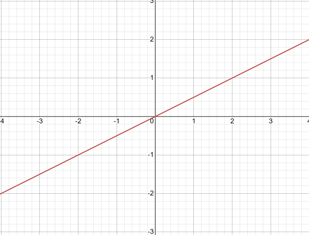
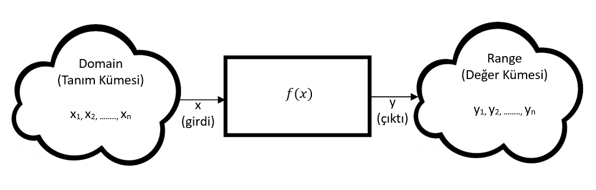
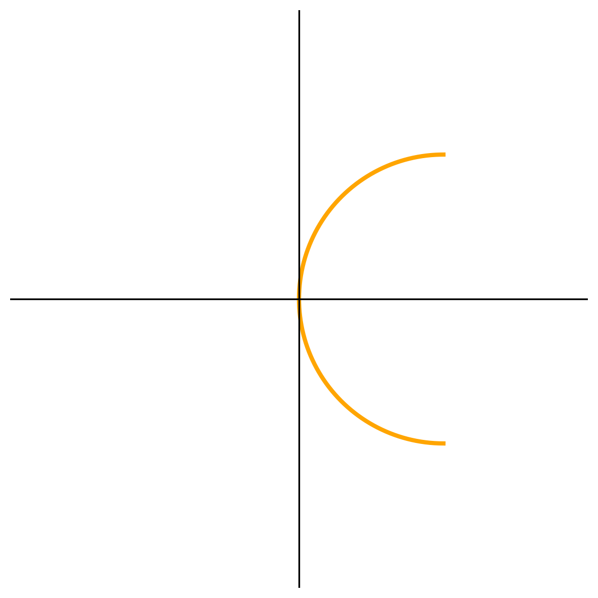
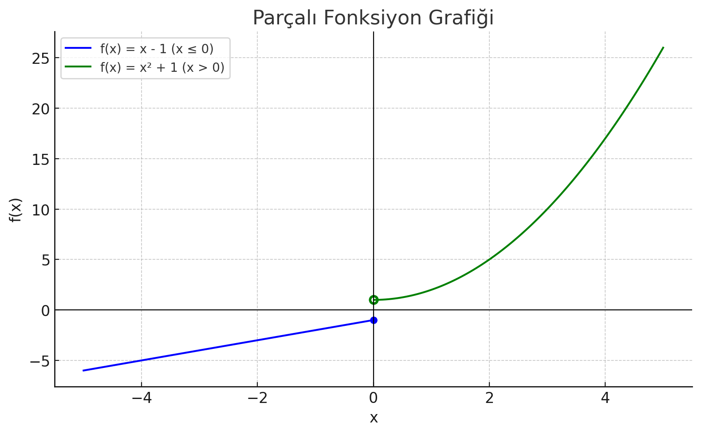
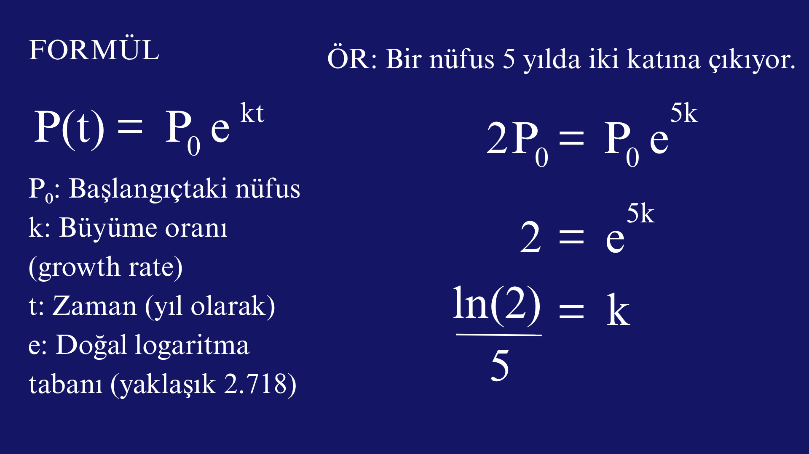

# 📐 Modül 1: Fonksiyonlar ve Limitler

Bu modülde matematiksel fonksiyonların temellerini, tanım ve değer kümelerini, parçalı fonksiyonları ve temel matematiksel işlemleri öğreneceksiniz.

---

## 🔢 Fonksiyon Nedir?

Bir fonksiyon, gerçek dünyadan elde edilmiş değerler(değişkenler) arasındaki ilişkinin matematiksel modelidir. 

Örnek : Varsayalım A bitkisine günlük olarak santimetre cinsinden yerden yüksekliğinin (sayısal değerinin) yarısı kadar mililitre su verilmesi gerekiyor olsun.  İlgili durum matematiksel olarak aşağıdaki şekilde modellenebilir. Ve bu sayede model tasarlanacak otomatik sulama sisteminde kullanılabilir. 

x: A bitkisinin cm cinsinden yerden yüksekliğinin sayısal değeri. 

y: mm cinsinden verilmesi gereken su miktarı.

$y\ =\ x\ /\ 2\ $

$f\left(x\right)=x/2 $

İlgili modelin grafiği çizilecek olursa;

Bir fonksiyonun temel tanımı aşağıdaki şekilde özetlenebilir:

Girdi alır → İşlem yapar → Tek bir çıktı üretir.

Örneğin:  
 f(x) = x² + 1

Bu fonksiyon bir paraboldür.

- f(0) = 0² + 1 = 1
- f(1) = 1² + 1 = 2
- f(-1) = (-1)² + 1 = 2
- f(2) = 2² + 1 = 5

İki küme arasındaki ilişki yani değerleri birbirlerine bağlayan bağıntı üzerinde düşünebilmek, konuşabilmek için iki temel kavramın bilinmesi gerekir;

- __Tanım Kümesi (Domain):__ Girdi kümesini yani bağımsız değişkenlerin kümesini ifade eder. 

- __Değer Kümesi (Range)__: Girdi kümesindeki elemanların matematiksel model ile elde edilen çıktı değerlerinin yer aldığı kümedir.

İki küme arasındaki bir ilişkinin(bağıntının) fonksiyon olarak kabul edilebilmesi için bazı özel şartları sağlaması gerekir. 
1.	Tanım kümesinde yer alan her bir elemanın değer kümesinde bir karşılığı, değeri bulunmalıdır. 
2.	Tanım kümesinde yer alan değerler için değer kümesinde bir den fazla karşılık, değer bulunmamalıdır. 

*Örneğin aşağıda görülen grafik bir fonksiyona ait değildir.*

>__*Not:*__
İki değişken arasındaki ilişkiyi modelleyen bir bağıntının fonksiyon olmaması onu matematiksel açıdan değersiz kılmaz ancak bizi fonksiyonlar üzerinde tanımlı matematiksel yaklaşımları kullanabilme lüksünden mahrum bırakır. 

### f(x) = 1 / x fonksiyonunun tanım ve değer kümesini inceleyelim.

| Özellik                   | Açıklama                                                                    |
| ------------------------- | --------------------------------------------------------------------------- |
| **Tanım Kümesi (Domain)** | x = 0 yazılamaz çünkü payda sıfır olur ve tanımsızdır.  **x ∈ ℝ, x ≠ 0** |
| **Değer Kümesi (Range)**  | 1 hiçbir reel sayıya bölündüğünde sonuç 0 olamaz.  **y ∈ ℝ, y ≠ 0**      |

### g(x) = √(x + 1) Fonksiyonunun Tanım ve Değer Kümesi

| Özellik                   | Açıklama                                                                     |
| ------------------------- | ---------------------------------------------------------------------------- |
| **Tanım Kümesi (Domain)** | Karekök içinde negatif sayı gerçek sayı değildir.  **x + 1 ≥ 0 → x ≥ -1** |
| **Değer Kümesi (Range)**  | Karekök fonksiyonunun sonucu negatif olamaz.  **y ≥ 0**                   |

## Parçalı Fonksiyonlar (Piecewise Functions)

Bazen bir fonksiyon, farklı x değerleri için **farklı kurallara göre tanımlanır**. Bu tür fonksiyonlara **parçalı (piecewise) fonksiyonlar** denir.

f(x) = {

        x² + 1    if x > 0  ,

        x - 1     if x <= 0

}

Bu fonksiyonun grafiğini çizersek:

x² + 1 kısmı yalnızca x > 0 için geçerlidir. Bu yüzden 0 noktasında açık daire ile başlar.

x − 1 kısmı x ≤ 0 için geçerlidir. Bu yüzden 0 noktasında kapalı daire ile başlar.

Bu fonksiyon **süreksizdir** çünkü iki parça x = 0 noktasında birleşmez.

## Bir Matematiksel İfadeye Neler Yapabiliriz?

- Çarpma işleminde bir (1) etkisiz elemandır. Dolayısıyla bir ifadeyi bir (1) ile çarpmak onun temsil ettiği değer üzerinde herhangi bir değişikliğe neden olmaz. Aşağıdaki örneği inceleyiniz. 1/2 ve 3/6 ifadelerinin her ikisinin de bir bütünün yarısını temsil eden sayısal değerlerdir.

  $\frac{1}{2}\times\ \frac{3}{3}=\ \frac{3}{6}$

- Bir eşitliğin her iki tarafında aynı işlemin uygulanması o eşitliği etkilemeyecektir. Sadece aynı eşitliğin başka bir biçimini hatta bazı durumlarda daha sade bir biçimini elde etmenizi sağlayacaktır. Aşağıdaki örneği inceleyiniz. 

  $x+5=7\$

  $x+5-5\ =7-5\ $

  $x=2$

- Bir ifadeye aynı şeyin eklenip çıkarılması yani sıfır eklenmesi o ifadenin değerini değiştirmez. Yaygın uygulamalarından bir tanesi bir ifadenin sadeleştirmelerde kullanılabilmesi için farklı biçimde ifadesinin sağlanmasıdır. Bir başka yaygın uygulama ise bir ifadenin çarpanlarına ayrılabilmesi için terim eklenip çıkarılmasıdır. Aşağıdaki örnekleri inceleyiniz.

  __(Örnek 1)__

  ${\ x}^2+2x\ =\ {\ x}^2+2x+1-1={\ \left(x+1\right)}^2-1$

  __(Örnek 2)__

  ${\ x}^4+\ x^2\ +1={\ x}^4+\ x^2\ +1+\ x^2-\ x^2\ $
  
  ${\ x}^4+\ x^2\ +1={\ x}^4+\ 2x^2\ +1\ -\ x^2$
  
  ${\ x}^4+\ x^2\ +1={(x^2\ +1)}^2\ -\ x^2$
  
  ${\ x}^4+\ x^2\ +1=(x^2-x\ +1)(x^2+x\ +1)$

## İkinci Dereceden Binom Açılımı

(x+2)(x+2)=

- x \* x = $x^2$
- x \* 2 = 2x
- 2 \* x = 2x
- 2 \* 2 = 4

Toplayalım:

$x^2 + 2x + 2x + 4 = x^2 + 4x + 4$

## Üçüncü Dereceden Binom Açılımı

$(x + y)^3 = (x + y)(x + y)(x + y) = (x^2 + 2xy + y^2)(x + y)$

- $x^2 \cdot x = x^3$
- $x^2 \cdot y = x^2 \cdot y$
- $2xy \cdot x = 2x^2 \cdot y$
- $2xy \cdot y = 2xy^2$
- $y^2 \cdot x = xy^2$
- $y^2 \cdot y = y^3$

Hepsini toplayalım:

$x^3 + (x^2 \cdot y + 2x^2 \cdot y) + (2x \cdot y^2 + x \cdot y^2) + y^3 = x^3 + 3x^2 \cdot y + 3x \cdot y^2 + y^3$

## Pascal Üçgeni ile Hızlı Açılım

- ilk terimi ikinci parantezdeki her şeyle çarp
- sonra diğer terimi çarp
  Buna **FOIL** denir: First, Outer, Inner, Last (İlk, Dış, İç, Son).
- Çıkan sonuçları topla:

| Üs (n) | Açılım Katsayıları |
| ------ | ------------------ |
| 0      | 1                  |
| 1      | 1 1                |
| 2      | 1 2 1              |
| 3      | 1 3 3 1            |
| 4      | 1 4 6 4 1          |

***Örnek:***

$(x + y)^4 = x^4 + 4x^3 \cdot y + 6x^2 \cdot y^2 + 4x \cdot y^3 + y^4$

## Paydayı Rasyonelleştirme

### Paydada Kökten Kurtulma

| Aşama           | Açıklama                                                             |
| --------------- | -------------------------------------------------------------------- |
| 1. Amaç         | Paydadaki karekökten kurtulmak (irrasyonel ifadeyi rasyonelleştirme) |
| 2. Örnek İfade  | (x - 2) / √(x + 3)                                                   |
| 3. Tanım Kümesi | √(x + 3) ≥ 0 ve payda ≠ 0 → x + 3 > 0 → x > -3                       |
| 4. Genişletme   | Pay ve paydayı √(x + 3) ile çarp:                                    |
|                 | (x - 2)/√(x + 3) × √(x + 3)/√(x + 3)                                 |
| 5. Sonuç        | ((x - 2) \* √(x + 3)) / (x + 3)                                      |
| 6. Not          | x - 2 ifadesinin tamamı çarpılmalı. Sadece -2 çarpılırsa hata olur.  |
| 7. Basit Örnek  | 2 / √2 × √2 / √2 = (2 \* √2) / 2 = √2                                |
| 8. Özet         | Aynı kökle çarpılır, tanım kümesi pozitiftir, değer değişmez.        |

## Üs Kuralları (Exponent Rules)

Aynı sayı ya da değişken birden fazla kez çarpılıyorsa, üs kullanılır. `x · x · x = x³`

Tabanlar aynıysa, çarpımda üsler toplanır. `x² · x³ = x⁵` → Çünkü `x · x · x · x · x`

Bir üslü ifade tekrar üslendirilirse üsler çarpılır. `(x²)³ = x⁶`

Her sayının sıfırıncı kuvveti 1’dir (x ≠ 0). `x⁰ = 1`

Negatif üs, kesirli hale getirir. `x⁻² = 1 / x²`

Tabanlar aynıysa, bölmede üsler çıkarılır. `x³ / x = x²`

Kök ifadeleri üslü olarak yazılabilir. `√x = x^(1/2)`   `∛x = x^(1/3)`   `√(x⁴) = x²`

## Logaritma Nedir?

Bir sayının üssünü bulmak için kullanılan matematiksel ifadedir.

### Temel Logaritma Kuralları

$$
\begin{align*}
\log_b b = 1 \\
\log_b 1 = 0 \\
\log_b b^k  = k \\
e^x   = 5 \quad \text{ise} \quad x = \ln(5) \\
2^x   = 8 \quad \text{ise} \quad x = \log_2(8) = 3 \\
\log_b(m \times n) = \log_b(m) + \log_b(n) \\
\log_b(m \div n)   = \log_b(m) - \log_b(n)
\end{align*}
$$

## Logaritmaların Uygulamaları

### Sürekli Nüfus Artışı (Population Growth)

| Uygulama Alanı     | Açıklama                  | Logaritma Nerede Kullanılır?      |
| ------------------ | ------------------------- | --------------------------------- |
| Nüfus Artışı       | Exponential büyüme        | Büyüme oranı **k** bulunurken     |
| Yatırım ve Faiz    | Sürekli faiz artışı       | Faiz oranı ve süre hesaplamasında |
| Radyoaktif Bozunma | Maddenin zamanla azalması | Azalma oranı **k** bulunurken     |

