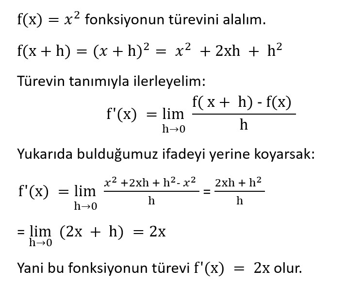
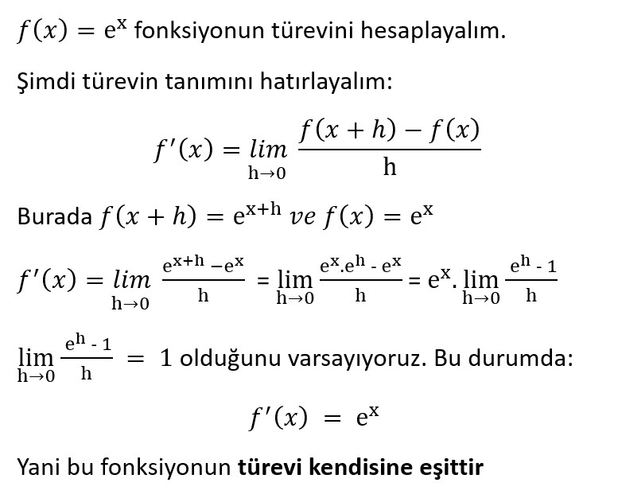
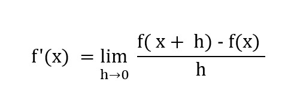

# 📈 Modül 3: Türev ve Diferansiyel Hesap

Bu modülde türev kavramını derinlemesine inceleyeceğiz ve türevin geometrik anlamını, teğet eğimi hesaplamasını öğreneceksiniz.

---

## 📊 Türev (Derivative)

Temel olarak girdi değişkeninin anlık değişimine karşı fonksiyonun (matematiksel model) davranışını yani çıktı değişkeninin o anda nasıl değiştiğini gözlemlememizi sağlayan bir araçtır. Bunu ilgili noktadaki değişim oranını yani eğimini hesaplayabilmek adına *__“limit”__* kavramından yararlanarak gerçekleştirir. 

$$
eğim (m) = \ \frac{{y_1-\ y}_0}{{x_1-\ x}_0}
$$

Yukarıdaki eğim denkleminden de görülebileceği gibi herhangi bir doğruyu tanımlayabilmek, onun eğimini hesaplayabilmek için en az iki noktaya ihtiyacımız vardır. Peki nasıl yapacağız da tek bir noktadan yararlanarak o noktadaki anlık değişim oranını yani çizilen teğet doğrusunun eğimini hesaplayabileceğiz? __*“limit”*__ yaklaşımı tam olarak burada devreye girmektedir. 
Anlık değişim oranını merak ettiğimiz bir $x_0$ noktası ve yardımcı olması için $x_1$ noktamız olsun…

$x_0$: eğimini merak ettiğimiz fonksiyon girdi noktası olsun. 

$x_1$: $x_0$ noktasına h kadar uzaklıkta yardımcı girdi noktası olsun. Yani $x_1=\ x_0+h$ olsun. 

$y_0$: $x_0$ noktasının fonksiyon aracılığı ile elde edilen görüntüsü yani $f(x_0)$.

$y_1$: $x_1$ noktasının fonksiyon aracılığı ile elde edilen görüntüsü yani $f(x_1)$.  Başka bir deyişle $f(x_0+h\ )$.

${(x}_0,\ y_0)$ ve  ${(x}_1,\ y_1)$ noktaları eğim denkleminde yerlerine yazılırsa; 

$m=\ \frac{{y_1-\ y}_0}{{x_1-\ x}_0}$

$m=\ \frac{f(x_0+h\ )-f(x_0)}{{(x_0+h)\ -\ x}_0}$

$m=\ \frac{f(x_0+h\ )-f(x_0)}{h}$

Esasen biz fonskiyon grrafiği üzerinde yer alan ${(x}_0,\ y_0)$ ve  ${(x}_1,\ y_1)$ noktaları arasında oluşturulmuş doğrunun eğimini değil ${(x}_0,\ y_0)$ noktasında teğet olan tek bir doğrunun eğimini istiyoruz. ${(x}_1,\ y_1)$ noktası ${(x}_0,\ y_0)$ noktasına ne kadar yaklaştırılırsa, yani h uzaklığı ne kadar sıfıra yakınsarsa bu iki nokta ile elde ettiğimiz doğru da o derece ${(x}_0,\ y_0)$ noktasındaki teğet doğrusunun eğimine yani anlık değişim oranına benzeyecektir. Buradan hareketle $f(x)$ fonksiyonun türevi aşağıdaki şekilde olacaktır ve o noktadaki anlık değişimi yani eğimi verecektir. 

$$
m =\ f(x_0)'\ = \lim_{h\rightarrow 0}{\frac{f(x_0+h\ )-f(x_0)}{h}}
$$

# FONKSİYONUN TÜREVİ

Aşağıdaki örneği inceleyelim:

Fonksiyonun grafiğini çizelim:

x=1 için eğim: 2

x=−1 için eğim: -2

x=0 için eğim: 0 (minimum nokta)

Grafiğe baktığımızda, x arttıkça türev (eğim) de artmış, grafik daha dik hale gelmiş.

# Üstel Fonksiyonun Türevi

Bu fonksiyon sıfıra asla ulaşmaz; x azaldıkça y eksenine yaklaşır ama değmez

x=0 için: türev = 1

x=1 için: türev = e

x=−1 için: türev = 1/e

Yani fonksiyonun herhangi bir noktasındaki eğim (türev), o noktadaki y değeriyle aynıdır.

# Sabit Fonksiyonun Türevi

f(x) = 2 fonksiyonunun türevini hesaplayalım.
Öncelikle türev formulünü hatırlayalım:

Burada hem f(x+h) hem de f(x) sabit olarak 2 olduğu için:
(2 - 2)/h = 0/h = 0

Yani limit de 0 olur.

