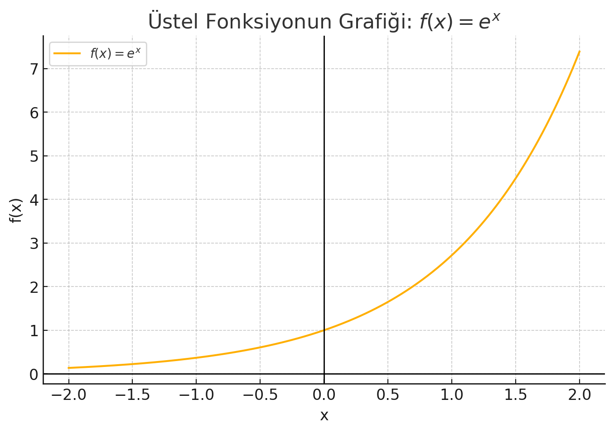
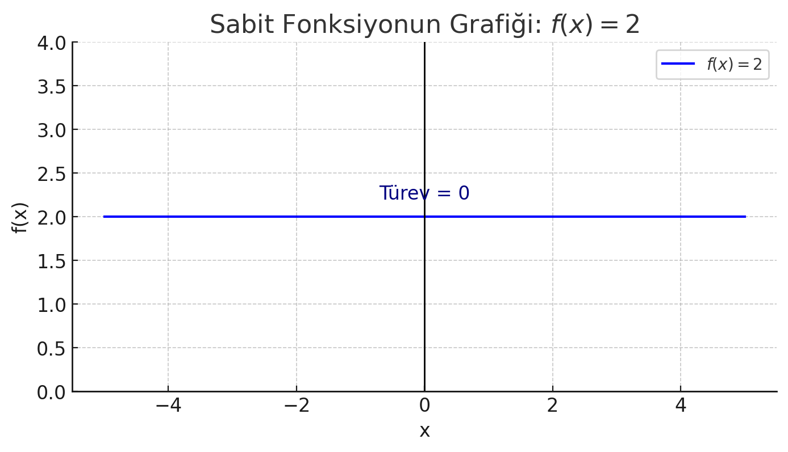

# 📈 Modül 3: Türev ve Diferansiyel Hesap

Bu modülde türev kavramını derinlemesine inceleyeceğiz ve türevin geometrik anlamını, teğet eğimi hesaplamasını öğreneceksiniz.

---

## 📊 Türev (Derivative)

Temel olarak girdi değişkeninin anlık değişimine karşı fonksiyonun (matematiksel model) davranışını yani çıktı değişkeninin o anda nasıl değiştiğini gözlemlememizi sağlayan bir araçtır. Bunu ilgili noktadaki değişim oranını yani eğimini hesaplayabilmek adına *__“limit”__* kavramından yararlanarak gerçekleştirir. 

$$
eğim (m) = \ \frac{{y_1-\ y}_0}{{x_1-\ x}_0}
$$

Yukarıdaki eğim denkleminden de görülebileceği gibi herhangi bir doğruyu tanımlayabilmek, onun eğimini hesaplayabilmek için en az iki noktaya ihtiyacımız vardır. Peki nasıl yapacağız da tek bir noktadan yararlanarak o noktadaki anlık değişim oranını yani çizilen teğet doğrusunun eğimini hesaplayabileceğiz? __*“limit”*__ yaklaşımı tam olarak burada devreye girmektedir. 
Anlık değişim oranını merak ettiğimiz bir $x_0$ noktası ve yardımcı olması için $x_1$ noktamız olsun…

$x_0$: eğimini merak ettiğimiz fonksiyon girdi noktası olsun. 

$x_1$: $x_0$ noktasına h kadar uzaklıkta yardımcı girdi noktası olsun. Yani $x_1=\ x_0+h$ olsun. 

$y_0$: $x_0$ noktasının fonksiyon aracılığı ile elde edilen görüntüsü yani $f(x_0)$.

$y_1$: $x_1$ noktasının fonksiyon aracılığı ile elde edilen görüntüsü yani $f(x_1)$.  Başka bir deyişle $f(x_0+h\ )$.

${(x}_0,\ y_0)$ ve  ${(x}_1,\ y_1)$ noktaları eğim denkleminde yerlerine yazılırsa; 

$m=\ \frac{{y_1-\ y}_0}{{x_1-\ x}_0}$

$m=\ \frac{f(x_0+h\ )-f(x_0)}{{(x_0+h)\ -\ x}_0}$

$m=\ \frac{f(x_0+h\ )-f(x_0)}{h}$

Esasen biz fonskiyon grrafiği üzerinde yer alan ${(x}_0,\ y_0)$ ve  ${(x}_1,\ y_1)$ noktaları arasında oluşturulmuş doğrunun eğimini değil ${(x}_0,\ y_0)$ noktasında teğet olan tek bir doğrunun eğimini istiyoruz. ${(x}_1,\ y_1)$ noktası ${(x}_0,\ y_0)$ noktasına ne kadar yaklaştırılırsa, yani h uzaklığı ne kadar sıfıra yakınsarsa bu iki nokta ile elde ettiğimiz doğru da o derece ${(x}_0,\ y_0)$ noktasındaki teğet doğrusunun eğimine yani anlık değişim oranına benzeyecektir. Buradan hareketle $f(x)$ fonksiyonun türevi aşağıdaki şekilde olacaktır ve o noktadaki anlık değişimi yani eğimi verecektir. 

$$
m =\ f(x_0)'\ = \lim_{h\rightarrow 0}{\frac{f(x_0+h\ )-f(x_0)}{h}}
$$

Örnek ile daha iyi anlamaya çalışalım. 

__Örnek:__ Ahmet’in çizgisel bir yolda bulunduğu konum(x), zamanın(t) karesine bağlı olarak elde ediliyor olsun. Matematiksel olarak modelleyecek olursak ilgili model ve fonksiyon aşağıdaki şekilde olacaktır. 

$x\ ={\ t}^2$

$f(t)\ =\ {\ t}^2$

Ahmet’in hızını, yani saniyede aldığı mesafe değerinin 0, 1 ve 2. saniyelerdeki anlık değişimini bulalım. 

- $x_0=0\$ için;

  $x_1=0+h$ yani $x_1=h$ olur.
  
  $y_0=f(0)$ olur.
  
  $y_1=f(0+h\ )$ yani $y_1=f(h\ )$ olur.
  
  Yerlerine yazılarak çözüm gerçekleştirilirse $f(0)' = 0$ olarak bulunur.
  
  $f(0)'\ =\lim_{h\rightarrow 0}{\frac{f(h\ )-f(0)}{h}}$
  
  $f(0)'\ =\lim_{h\rightarrow 0}{\frac{{\ h}^2-{\ 0}^2}{h}}$
  
  $f(0)'\ =\lim_{h\rightarrow 0}{\frac{{\ h}^2}{h}}$
  
  $f(0)'\ =\lim_{h\rightarrow 0}{\ \ h}$
  
  $f(0)'\ =0$
  

- $x_0=1\$ için;
  
  $x_1=1+h$ olur.
  
  $y_0=f(1)$ olur.
  
  $y_1=f(1+h\ )$ olur.
  
  Yerlerine yazılarak çözüm gerçekleştirilirse $f(1)' = 2$ olarak bulunur.
  
  $f(1)'\ =\lim_{h\rightarrow 0}{\frac{f(1+h\ )-f(1)}{h}}$
  
  $f(1)'\ =\lim_{h\rightarrow 0}{\frac{(1+{\ h)}^2-{\ 1}^2}{h}}$
  
  $f(1)'\ =\lim_{h\rightarrow 0}{\frac{{\ 1+2h\ +h}^2-1}{h}}$
  
  $f(1)'\ =\lim_{h\rightarrow 0}{\ \ \frac{{\ 2h\ +h}^2}{h}\ }$
  
  $f(1)'\ =\lim_{h\rightarrow 0}{\ \ \frac{{\ 2h\ +h}^2}{h}\ }$
  
  $f(1)'\ =\lim_{h\rightarrow 0}{\ \ \frac{h(2+h)}{h}\ }$
  
  $f(1)'\ =\lim_{h\rightarrow 0}{\ \ (2+h)}$
  
  $f(1)'\ =2$

- $x_0=2\$ için;
  
  $x_1=2+h$ olur.
  
  $y_0=f(2)$ olur.
  
  $y_1=f(2+h\)$ olur.
  
  $Yerlerine yazılarak çözüm gerçekleştirilirse $f(2)' = 4$ olarak bulunur.
  
  $f(2)'\ =\lim_{h\rightarrow 0}{\frac{f(2+h\ )-f(2)}{h}}$
  
  $f(2)'\ =\lim_{h\rightarrow 0}{\frac{(2+{\ h)}^2-{\ 2}^2}{h}}$
  
  $f(2)'\ =\lim_{h\rightarrow 0}{\frac{{\ 4+4h\ +h}^2-4}{h}}$
  
  $f(2)'\ =\lim_{h\rightarrow 0}{\ \ \frac{{\ 4h\ +h}^2}{h}\ }$
  
  $f(2)'\ =\lim_{h\rightarrow 0}{\ \ \frac{h(4+h)}{h}\ }$
  
  $f(2)'\ =\lim_{h\rightarrow 0}{\ \ (4+h)}$
  
  $f(2)'\ =4$

Peki herhangi bir x noktası için ilgili fonksiyonun türevini genel bir hale dönüştürebilir miyiz? Deneyelim...

## FONKSİYONUN TÜREVİ

 $f(x)\ =\ {\ x}^2$ fonksiyonunun türevini alalım.

 $f(x+h)\ =\ {(\ x+h)}^2\ =\ {\ x}^2+\ 2xh\ +\ {\ h}^2$

Türevin limit tanımıyla ilerleyelim. Ve bulduğumuz ifadeyi yerine yazalım. 

 $f(x)\prime=\lim_{h\rightarrow 0}{\frac{f(x+h\ )-f(x)}{h}} $

 $f(x)\prime=\lim_{h\rightarrow 0}{\frac{{\ x}^2+\ 2xh\ +\ {\ h}^2-{\ x}^2}{h}}\ =\ \frac{\ 2xh\ +\ {\ h}^2}{h} $

 $f(x)\prime=\lim_{h\rightarrow 0}{\ 2x\ +\ h}\ $ 

 $f(x)\prime\ =2x\ $ 

Fonksiyonun grafiğini çizelim.

x=1 için eğim: 2

x=−1 için eğim: -2

x=0 için eğim: 0 (minimum nokta)

Grafiğe baktığımızda, x arttıkça türev (eğim) de artmış, grafik daha dik hale gelmiş.

# Üstel Fonksiyonun Türevi

$f(x)\ =\ e^x$ fonksiyonunun türevini hesaplayalım. fonksiyonunun türevini hesaplayalım. Türevin tanımını hatırlayalım ve fonksiyonumuza göre gerekli düzenlemeleri gerçekleştirelim. 

$f(x)\prime=\lim_{h\rightarrow 0}{\frac{f(x+h\ )-f(x)}{h}} $

$f(x+h)\ =e^{x+h} ve  f(x)\ =\ e^x$

$f(x)\prime=\lim_{h\rightarrow 0}{\frac{e^{x+h}\ -e^x}{h}\ =\ }\lim_{h\rightarrow 0}{\frac{e^x.e^h\ -e^x}{h}\ =\ e^x\lim_{h\rightarrow 0}{\frac{e^h\ -\ 1}{h}\ \ }\ }$      

Varsayım olarak $\lim_{h\rightarrow 0}{\frac{e^h\ -\ 1}{h}\ \ }\ =\ 1  dir.$ 

$f(x)\prime=\ e^x$  olarak bulunur. 

Yani bu fonksiyonun türevi kendisine eşittir. 

Bu fonksiyon sıfıra asla ulaşmaz; x azaldıkça y eksenine yaklaşır ama değmez

x=0 için: türev = 1

x=1 için: türev = e

x=−1 için: türev = 1/e

Yani fonksiyonun herhangi bir noktasındaki eğim (türev), o noktadaki y değeriyle aynıdır.

# Sabit Fonksiyonun Türevi

f(x) = 2 fonksiyonunun türevini hesaplayalım.
Öncelikle türev formulünü hatırlayalım:
$f(x)\prime=\lim_{h\rightarrow 0}{\frac{f(x+h\ )-f(x)}{h}} $

Burada hem f(x+h) hem de f(x) sabit olarak 2 olduğu için:
(2 - 2)/h = 0/h = 0

Yani limit de 0 olur.

