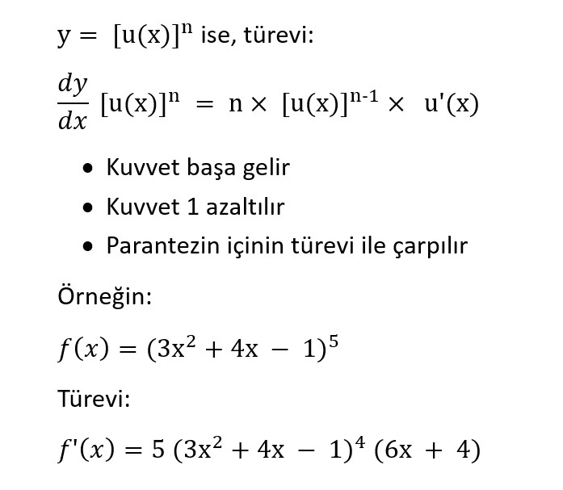
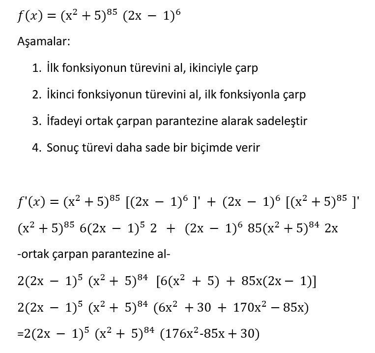

# 🔗 Modül 4: Türev Kuralları (Çarpım, Bölüm, Zincir)

Bu modülde türev kurallarını, çarpım ve bölüm kurallarını, zincir kuralını detaylı olarak öğreneceksiniz.

---

## ⚡ TÜREV KURALLARI

### Çarpım Kuralı

(f⋅g)′= f ⋅ g ′ + f ′ ⋅ g

- İlk fonksiyonu aynen yaz, ikinci fonksiyonun türevini al → 𝑓⋅𝑔′

- Sonra ilk fonksiyonun türevini al, ikinci fonksiyonu aynen yaz → 𝑓′⋅𝑔

- Sonra bu iki ifadeyi topla

### Uygulama Örneği

𝑓(𝑥)= 𝑥^2 − 2 ⇒ 𝑓′(𝑥) = 2𝑥

𝑔(𝑥)= 𝑥^2 + 𝑥 ⇒ 𝑔 ′(𝑥) = 2𝑥 + 1

Uygularsak:

ℎ′(𝑥)= (𝑥^2 −2) (2𝑥 + 1) + (2𝑥) (𝑥^2 + 𝑥)

ℎ′(𝑥)= 4𝑥^3 + 3𝑥^2 − 4𝑥 − 2

### Sabit Sayı ile Fonksiyonun Türevi

Eğer elimizde bir **sabit sayı ile çarpılmış bir fonksiyon varsa**, bu ifadenin türevi yalnızca:

SABİT x FONKSİYONUN TÜREVİ

Bu sonuç çarpımın türevinden çıkar. Sabitin türevi c'=0 olduğundan, ilk terim yok olur

(c⋅ f(x))′= c' ⋅ f(x) + c ⋅ f'(x) = c . f'(x)

ÖRNEKLER:

1- 3.e^x = 3.e^x

2- (4x^2)' = 8x

## Bölüm Kuralı

(N/D)' = (DN' - ND') / D^2

(x^2 - 3x) / (x^2 + 4) fonksiyonunun türevini alalım

[ (x^2 + 4) (x^2 - 3x)' - (x^2 -3x)(x^2 +4)' ] / (x^2 + 4)^2

[ (x^2 +4)(2x - 3) - (x^2 - 3x) (2x) ] / (x^2 +4)^2

= [ 3x^2 + 8x - 12 ] / (x^2+4)^2

## Zincir Kuralı (Chain Rule)

Eğer bir fonksiyonun tamamı bir kuvvete sahipse, bu durumda zincir kuralı kullanılır.

### Zincir Kuralı ve Çarpım Kuralı

## Neden Türev Alıyoruz ?

- Bir fonksiyonun maksimum veya minimum yaptığı noktaları bulmak için türev kullanılır.
  Çünkü bu ekstremum noktalarında fonksiyonun eğimi sıfır olur, yani:

  f'(x) = 0

- Grafik üzerinde fonksiyonun arttığı (türev > 0) veya azaldığı (türev < 0) yerleri analiz etmek için kullanılır.
