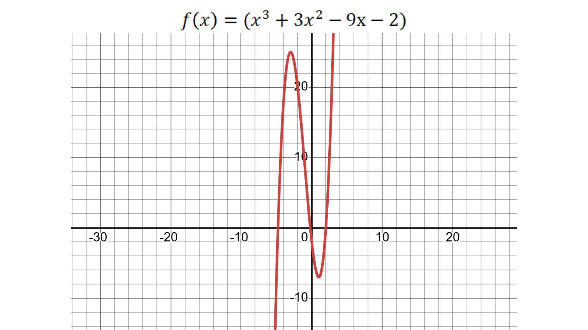
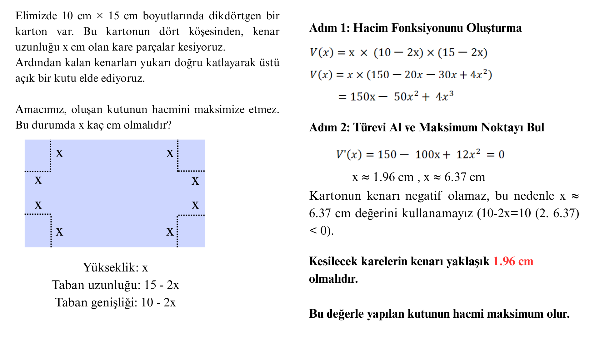

# Fonksiyonda Maksimum - Minimum Nokta

**Maksimum:** Fonksiyonun ulaştığı en yüksek nokta

**Minimum:** Fonksiyonun ulaştığı en düşük nokta

Bu değerler, **türev(eğim) = 0** olduğu noktalarda gerçekleşir.

Şimdi aşağıdaki grafikleri inceleyelim

İlk grafiğimizde, grafik ilk önce artıyor, sonra azalıyor. Tepe noktasında (maksimumda) türev sıfırdır: F'(x) = 0 . Bu grafik, bir mutlak maksimum (absolute maximum) örneğidir.

Fonksiyonun ters çevrildiği İkinci grafiğimizde, grafiğin önce azalıp, sonra arttığını görüyoruz. En alt noktası var ama sonsuza kadar yukarı gittiği için maksimum yoktur. Buna da mutlak minimum (absolute minimum) denir.

Ancak bazı fonksiyonlar vardır ki, ne en yüksek ne en düşük nokta sabittir. Bu durumda göreli maksimum/minimum **(relative max/min)** olur.

## Göreli Maksimum & Minimum Örneği

Bu fonksiyonun grafiği:

Önce artar, sonra azalır, sonra tekrar artar. Yani: Bir göreli maksimum (tepe ama en yüksek değil) ve bir göreli minimum (dip ama en düşük değil) noktası vardır.

Bunların hepsi, türevin işareti ve sıfır olduğu noktalarla bulunabilir:

- Türev pozitifse: Fonksiyon artıyor.

- Türev negatifse: Fonksiyon azalıyor.

- Türev sıfırsa: Fonksiyon zirvede veya dipte (tepe noktası).

## Uygulama: Açık Kutunun Hacmini Maksimum Yapma Problemi

### İkinci Türev Testi (Second Derivative Test)

Yukarıda incelediğimiz örneği tekrar ele alalım:
Bu problemde, V(x) fonksiyonu açık kutunun hacmini temsil eder. Hacim, kutunun taban alanı ile yüksekliğinin çarpımı olarak hesaplanır.
V(x) = x(10−2x) (15−2x)

Elimizde iki kritik nokta var:

x ≈ 1.96 , x ≈ 6.37. Bu noktalar, türevin sıfır olduğu yerlerdir ve şu şekilde hesaplanır:

- Fonksiyonun türevi: V′(x) = 150 − 100x + 24x²
- Kritik noktaları bulmak için V′(x) = 0 denklemini çözeriz:
  - 150 − 100x + 24x² = 0
  - Bu denklemi çözerek yaklaşık olarak x ≈ 1.96 ve x ≈ 6.37 değerlerini elde ederiz.

Hangisinin maksimum, hangisinin minimum olduğunu anlamak için **İkinci Türev Yöntemi (Second Derivative Test)** kullanırız.
V′′(x) = −100 + 24x

V′′(1.96)<0 olduğundan bu nokta iç bükeydir (concave down) → Maksimum noktadır.

V′′(6.37)>0 olduğundan bu nokta dış bükeydir (concave up) → Minimum noktadır.

Bu yöntemle, grafiği çizmeden bile ikinci türevi kullanarak hangi noktanın maksimum, hangisinin minimum olduğunu anlayabiliriz. Özetlersek:

Grafik çok karmaşık olduğunda, maksimum ve minimum noktaları belirlemek için grafik çizmek yerine:

- Birinci türev ile kritik noktaları buluruz,
- İkinci türev ile bu noktaların maksimum mu minimum mu olduğuna karar veririz.

## Değişim Hızı (Rate of Change)

Türev aslında **değişim hızıdır**, yani y’nin x’e göre ne kadar hızlı değiştiğidir. Bu, eğimimizin ne kadar hızlı arttığı anlamına gelir. Çünkü eğim Δy / Δx — yani y’nin değişimi / x’in değişimidir. y ve x arasındaki bu değişimler giderek küçüldükçe türevi elde etmiş oluruz.

### İkinci Türev

Hız değişirse, yani **ivme** varsa: Bu, hızın zamana göre değişimi olur. Yani ikinci türevdir. d²y/dx² şeklinde gösterilir

| Türev            | Anlamı              |
| ---------------- | ------------------- |
| 1. türev (f′(x)) | Hız (velocity)      |
| 2. türev (f″(x)) | İvme (acceleration) |
