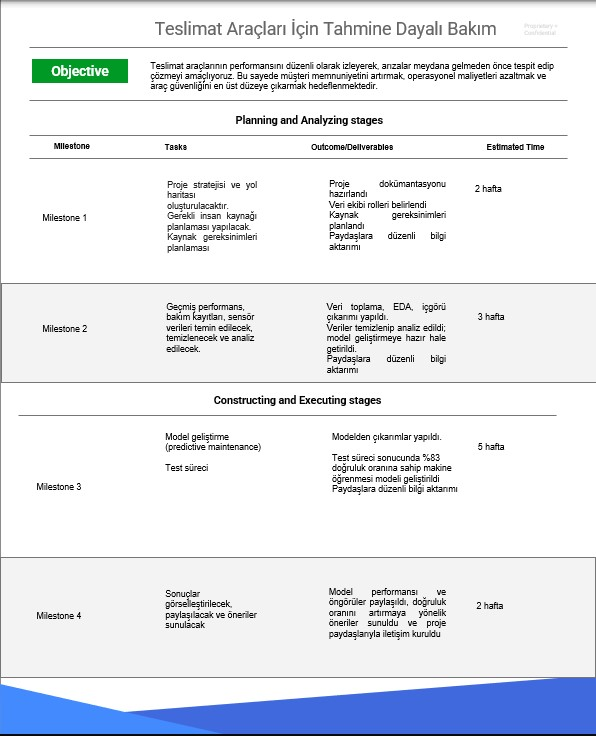

# PACE (Plan - Analyze - Construct - Execute)

Veri analitiği süreci genellikle aşağıdaki altı temel aşamadan oluşan bir iş akışı çerçevesiyle yürütülür:

1- Soru sor (Ask)

2- Hazırla (Prepare)

3- İşle (Process)

4- Analiz et (Analyze)

5- Paylaş (Share)

6- Harekete geç (Act)

Bu çerçeve birçok proje için faydalıdır; ancak büyük veri setlerinde daha fazla esneklik gerekebilir.

PACE, "Google Advanced Data Analytics" programı için veri uzmanlarının katkı ve geri bildirimleriyle geliştirilmiş bir çerçevedir.

**Amaç:** Projelere rehberlik edecek basit ama etkili bir yapı sunmaktır.

**Hedef:** Kendi iş akışınızı oluşturabileceğiniz bir temel hazırlamaktır.

## PACE Framework

| **Aşama**     | **Açıklama**                                                                                | **Faaliyetler**                                                                       |
| ------------- | ------------------------------------------------------------------------------------------- | ------------------------------------------------------------------------------------- |
| **Plan**      | Projenin kapsamı belirlenir, bilgi ihtiyaçları ve hedefler tanımlanır                       | Hedef belirleme, strateji planlama, iş etkilerini değerlendirme                       |
| **Analyze**   | Veri toplanır, temizlenir, dönüştürülür ve analiz edilir                                    | Veri toplama, EDA (keşifsel analiz), içgörü çıkarımı, veri kalitesi kontrolü          |
| **Construct** | Anlamlı içgörüler üzerine modelleme ve istatistiksel analiz yapılır                         | Model oluşturma, istatistiksel çıkarım, ilişkileri belirleme, iş birliği              |
| **Execute**   | Bulgular sunulur, paydaşlarla iletişim kurulur, sonuçlar paylaşılır ve önerilerde bulunulur | Sunum hazırlama, öneri geliştirme, geri bildirimle süreci güncelleme, paydaş yönetimi |

PACE’i bir devre gibi düşünürsek her bir aşamanın aktif olması gerekir. Bu devredeki enerji akışı ise iletişimle sağlanır. İletişim, her zaman bir yönde ilerlemek zorunda değildir. Genellikle planlamayla başlanır, ancak süreç içinde yeni bilgiler doğrultusunda analiz aşamasına geri dönülebilir ya da doğrudan execute aşamasına atlanabilir.

Yani PACE, her ne kadar sıralı gibi görünse de, iletişim akışı sayesinde ihtiyaç duyulan aşamaya kolayca geçilebilir.

# İletişimin Temel Unsurları

| **Unsur**              | **Tanım**                                    | **Dikkat Edilmesi Gerekenler**                                                              |
| ---------------------- | -------------------------------------------- | ------------------------------------------------------------------------------------------- |
| **Amaç (Purpose)**     | İletişimin neden gerçekleştiği, amacı nedir? | - İletişim analiz mi içeriyor?   - Stratejik içgörü mü sunuluyor?                        |
| **Alıcı (Receiver)**   | Mesajı alan kişi ya da kitle                 | - Hedef kitle kim?   - Ne biliyorlar?   - Ne bilmeleri gerekiyor?   - Etki zinciri |
| **Gönderici (Sender)** | Mesajı hazırlayan, ileten kişi (yani siz)    | - Rolünüz ne?   - Ne tür bilgi aktarıyorsunuz?   - Önyargılar mesajı nasıl etkiliyor? |

İletişim, veri toplama aşamasından model oluşturma ve sonuç paylaşımına kadar PACE’in tüm adımlarını besler.

## Etkili İletişim İçin 7 İpucu

| **İpucu**                          | **Öneri**                                                                         |
| ---------------------------------- | --------------------------------------------------------------------------------- |
| Hedef kitlenin dilinden konuşun    | Teknik terimleri sadeleştir, kısa cümleler kur, jargon ve süslü dilden kaçın      |
| Sorulara ve geri bildirime açık ol | Yapıcı geri bildirimle geliş, anlaşılamayan noktalar için açıklama fırsatı yarat  |
| Veriye bağ kuran kişi olun         | Süreci anlat, soruları zamanında yanıtla, veriyle içgörü arasında köprü kur       |
| Görselleştirmelerle anlat          | Basit, okunabilir, erişilebilir grafikler kullan; her görsel tek bir mesaj versin |
| Güçlü ilişkiler kur                | Açık, güvenilir, kapsayıcı iletişimle iş ilişkilerini güçlendir                   |
| Varsayımları fark et               | Önyargıları tanı, aktif dinle, doğru varsayımlarla ilerle                         |
| Veri sınırlamalarını belirle       | Eksik veri, örneklem yetersizliği ve önyargıları açıkça belirt                    |

**İyi Bir Veri Uzmanı:**

- Proaktif iletişim kurar.

- Sorulara zamanında ve açık yanıt verir.

- Paydaşları düzenli olarak bilgilendirir.

- Geri bildirime açık, çözüm odaklıdır.

## Başarılı İletişimin Temel Unsurları

| **Başlık**                 | **Açıklama**                                                                                         |
| -------------------------- | ---------------------------------------------------------------------------------------------------- |
| **İletişim Amacı (Neden)** | İletişim kurma sebebinizi netleştirin. Proje hedefi, beklentiler ve neyin iletileceği belirlenmeli.  |
| **Ortam (Setting)**        | Mesajın iletileceği ortam önemlidir. E-posta, toplantı veya sunum gibi farklı bağlamlar düşünülmeli. |
| **Birebir & Küçük Grup**   | Etkin dinleme yapın, önceden planlayın, karşılıklı uyumu sağlayacak sorular sorun.                   |
| **Zaman Yönetimi**         | Net, kısa, sade cümlelerle iletişim kurun. Jargondan kaçının, karmaşık fikirleri bölün.              |
| **Etkin Dinleme**          | Anlayış, empati ve güven oluşturur. Karşıdakinin bakış açısını anlamaya çalışın.                     |
| **Soru Sorma**             | Doğru sorular inovasyon ve anlayışı artırır. Bilgi açığını kapatır, riskleri önler.                  |

## Proje Teklifi Nedir ve Neden Önemlidir?

Proje teklifleri, ekip içinde görevlerin takibini sağlar ve değişken projelerde esneklik sunar. Projeler ilerledikçe hedefler, kaynaklar veya ekip üyeleri değişebilir, bu da yeni düzenlemeleri gerektirir.

### Proje Teklifinin (Proposal) Temel Bileşenleri

| Bileşen                        | Açıklama                                                                 |
| ------------------------------ | ------------------------------------------------------------------------ |
| **Başlık**                     | Kısa, öz ve amaca yönelik olmalıdır.                                     |
| **Amaç (Objective)**           | Projenin neyi başarmayı hedeflediğini açıklar (1-3 cümle).               |
| **Kilometre Taşları**          | Görevleri küçük ve yönetilebilir parçalara böler.                        |
| **Görevler (Tasks)**           | Her kilometre taşı altındaki iş adımlarıdır.                             |
| **Çıktılar (Outcomes)**        | Projeyi ilerleten tamamlanmış eylemler.                                  |
| **Teslimatlar (Deliverables)** | Projenin somut ürünleri.                                                 |
| **Paydaşlar (Stakeholders)**   | Proje başarısından doğrudan etkilenen kişi/kurumlar.                     |
| **Tahmini Süre**               | Kilometre taşları için zaman tahmini; proje ilerledikçe güncellenebilir. |

### PACE & Proje Teklifleri

PACE strateji belgeleri, proje teklifleri oluştururken yol gösterici bir kaynak olarak kullanılır. Belgelerde yer alan sorular, proje tekliflerinin amaç, analiz, yapılandırma ve uygulama aşamalarını daha net tanımlamana yardımcı olur.

# ÖRNEK PROJE TEKLİFİ

## Proje Senaryosu

Senaryo:
Uluslararası bir teslimat şirketinde veri uzmanı olarak çalışıyorsunuz. Şirket yönetimi, teslimat araç filosu için kestirimci bakım (predictive maintenance) sağlayan bir makine öğrenimi modeli geliştirilmesini istiyor. Bu model, arıza oluşmadan önce bunu tahmin ederek teslimat gecikmelerini, müşteri memnuniyetsizliğini ve yüksek onarım maliyetlerini önlemeyi amaçlamaktadır.

Hedef, %90 doğruluk oranına sahip bir model geliştirmektir. Projenin süresi 12 hafta olarak belirlenmiştir. Bu doğrultuda, proje teklifini hazırlamanız istenmektedir.

## PACE Tabanlı Proje Teklifi (Benim Çözümüm)

## PACE Tabanlı Proje Teklifi (Kursun Çözümü)

